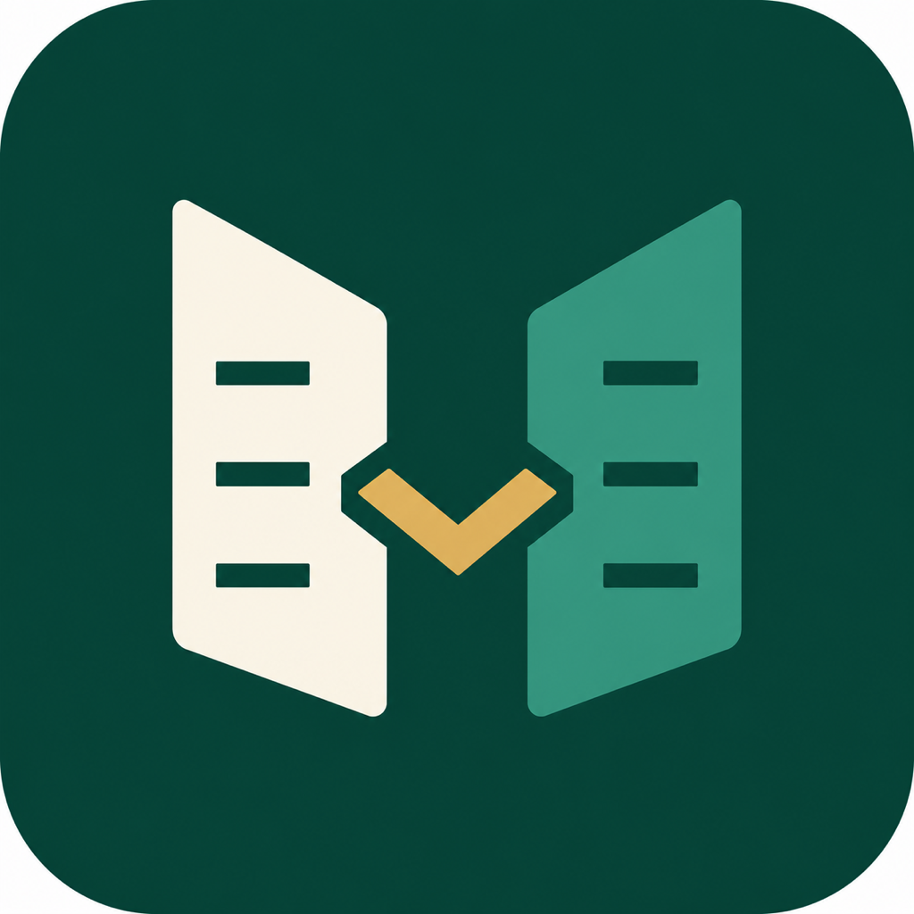
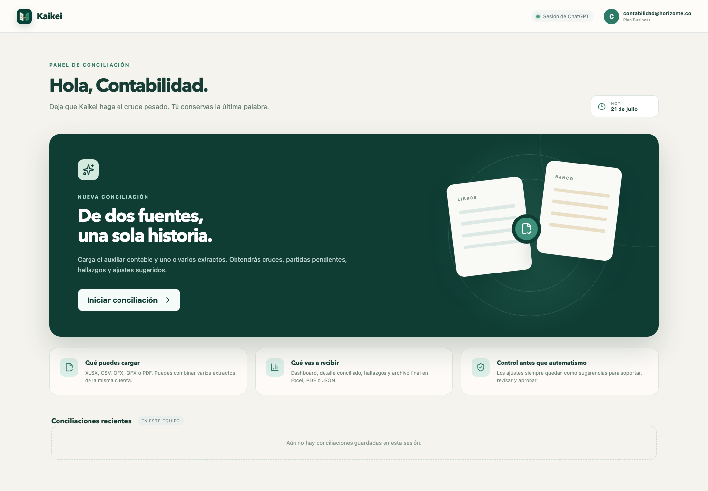
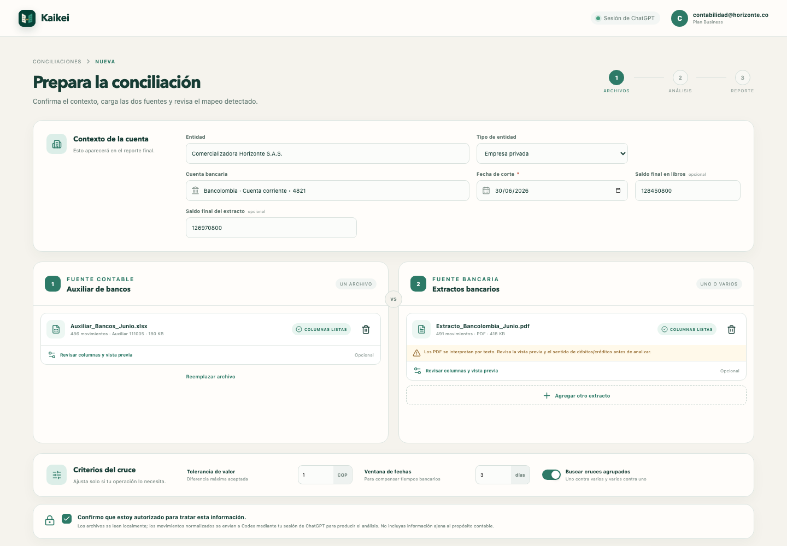
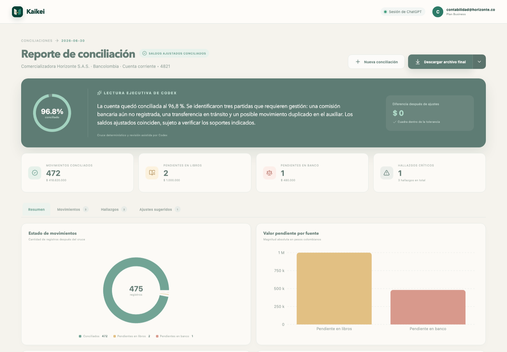

# Kaikei

[English version](README.en.md)

Aplicación Electron para macOS y Windows que concilia un auxiliar contable contra uno o varios extractos bancarios. Usa la sesión de ChatGPT mediante **Codex App Server**; no solicita una API key.

> Creado y mantenido por **Mauricio Samper** — Bogotá, Colombia<br>
> Contacto: [mauro@entey.net](mailto:mauro@entey.net)

<p align="center">
  
</p>

## OpenAI Build Week 2026

**Track:** Work & Productivity<br>
**Tagline:** From two financial records to one trusted answer.<br>
**Submission draft:** [Elevator pitch, Devpost story and demo script](docs/BUILDWEEK_SUBMISSION.md)

Kaikei was created during OpenAI Build Week from a plain-language accounting workflow. It is a working Electron product—not a chat mockup—with local financial-file parsing, deterministic reconciliation, GPT-5.6 exception analysis, schema-constrained output, dashboards and exportable reports.

### How I collaborated with Codex and GPT-5.6

Codex was the engineering collaborator throughout the project. It helped research the Colombian reconciliation context, turn the workflow into requirements, design the Electron and Codex App Server architecture, implement file parsers and matching logic, build the product interface, write automated tests, debug the packaged application, generate installers and prepare the documentation.

Mauricio Samper made the key product decisions: reuse the user's ChatGPT session instead of requiring an API key; keep file parsing local; use deterministic rules for arithmetic and matching; reserve GPT-5.6 for ambiguous exceptions and findings; and keep every proposed adjustment subject to human evidence, review and approval.

Inside the product, GPT-5.6 runs through `codex app-server` in an ephemeral read-only thread. The model receives normalized movements and deterministic candidates, and its final report must satisfy `turn/start.outputSchema`; Zod validates it again before the UI or exporters can consume it.

Judges can use the included sample files [`fixtures/auxiliar_demo.csv`](fixtures/auxiliar_demo.csv) and [`fixtures/extracto_demo.csv`](fixtures/extracto_demo.csv). The dated commit history and the main Codex thread document the work completed during the Build Week submission period.

## Qué incluye

- Inicio de sesión administrado por `codex app-server` y apertura del OAuth de ChatGPT en el navegador.
- Lectura local de XLSX, CSV, OFX, QFX y PDF.
- Detección y corrección manual del mapeo de fecha, descripción, referencia, valor, débito, crédito, tipo y saldo.
- Motor auditable de cruces por valor, signo, ventana de fechas, referencia y agrupaciones 1:N/N:1.
- Revisión de excepciones con Codex y salida validada contra JSON Schema.
- Dashboard de resultados, partidas pendientes, hallazgos, controles y ajustes sugeridos.
- Exportación final a Excel, PDF ejecutivo y JSON.
- Tratamiento diferenciado para empresas privadas, ESAL y entidades públicas.

## Capturas

### Inicio



### Carga y preparación de archivos



### Reporte de conciliación



## Requisitos

- Node.js 24 o superior para desarrollo.
- ChatGPT/Codex instalado, o un ejecutable `codex` disponible en `PATH`.
- Una cuenta de ChatGPT con acceso a Codex.

Kaikei busca automáticamente el binario de ChatGPT en macOS y rutas comunes de Windows. Si no lo encuentra, la pantalla de acceso permite seleccionarlo manualmente. El binario no se incluye en el instalador de este repositorio.

## Descargas

Los artefactos generados quedan en `release/`:

| Plataforma | Instalador |
| --- | --- |
| Windows x64 | `Kaikei Setup 0.1.0.exe` |
| macOS Apple Silicon | `Kaikei-0.1.0-arm64.dmg` |
| macOS Intel | `Kaikei-0.1.0.dmg` |

Los instaladores de esta versión de desarrollo no están firmados digitalmente ni notarizados. Para distribución pública deben configurarse certificados de Apple Developer ID y Windows Code Signing.

## Desarrollo

```bash
npm install
npm run dev
```

Validación completa:

```bash
npm run verify
```

Empaquetado:

```bash
npm run dist:mac
npm run dist:win
```

El instalador de Windows normalmente se genera en Windows o en CI con el entorno de firma correspondiente. Los artefactos quedan en `release/`.

## Flujo técnico

1. Electron inicia `codex app-server` por `stdio` y realiza el handshake JSONL.
2. `account/read` reutiliza una sesión existente; `account/login/start` inicia el acceso con ChatGPT cuando hace falta.
3. Los archivos se leen y normalizan en el proceso principal. El renderer recibe solo una vista previa y metadatos.
4. El motor local propone cruces determinísticos y detecta duplicados.
5. Se inicia un thread efímero, `read-only`, sin aprobaciones ni uso de herramientas. Codex recibe movimientos normalizados, candidatos y reglas de revisión.
6. `turn/start.outputSchema` obliga a que el mensaje final cumpla el esquema del reporte; Zod lo valida otra vez antes de mostrarlo.
7. Los exportadores trabajan sobre el reporte validado guardado en memoria durante la sesión.

La integración sigue la documentación oficial de [Codex App Server](https://learn.chatgpt.com/docs/app-server), que define autenticación, `account/login/start`, threads, turns, eventos y `outputSchema`.

## Alcance contable

La aplicación ayuda a preparar y documentar la conciliación. No registra asientos, no certifica estados financieros y no reemplaza al contador, revisor o aprobador. Las reglas y fuentes investigadas están en [docs/REGLAS_CONCILIACION_COLOMBIA.md](docs/REGLAS_CONCILIACION_COLOMBIA.md).

## Privacidad y seguridad

- `contextIsolation: true`, `nodeIntegration: false` y renderer en sandbox.
- Selección de archivos mediante diálogos nativos; no se exponen rutas al renderer.
- Sin servidor propio ni almacenamiento de contraseñas.
- Threads de análisis efímeros, sandbox de solo lectura y política de aprobación `never`.
- Consentimiento previo en UI antes de enviar movimientos normalizados a Codex.
- Límite de 25 MB y 15.000 filas por archivo.

Antes de distribuir comercialmente, completa el responsable, canales y política de tratamiento descritos en [docs/PRIVACIDAD_Y_PRODUCCION.md](docs/PRIVACIDAD_Y_PRODUCCION.md), firma los instaladores y valida los términos aplicables a tu organización.

## Prueba visual

En desarrollo puede abrirse una pantalla poblada sin enviar información real:

```text
http://127.0.0.1:5173/?demo=results
```

También están disponibles `?demo=home`, `?demo=files` y `?demo=processing`.

## Autor y derechos

Copyright © 2026 Mauricio Samper, Bogotá, Colombia. Todos los derechos reservados.

Este repositorio no concede una licencia de uso, modificación o redistribución salvo autorización expresa y escrita del autor. Para licenciamiento o colaboración escribe a [mauro@entey.net](mailto:mauro@entey.net).
